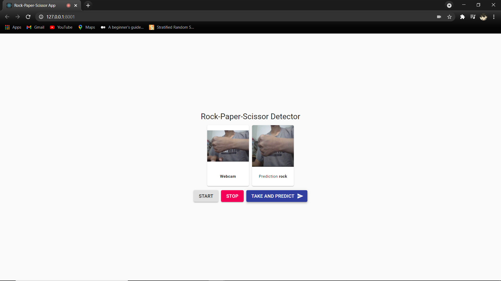

# Rock-Paper-Scissor detector in Django rest-framework



Develop rock-paper-scissor `tflite` model using `django-rest-framework` and deploy to `heroku`

## Run on local

1. Clone this repository<br>
   Clone this repo using git
   ```
   git clone https://github.com/Hyuto/rock-paper-REST.git
   ```
2. Create `virtualenv` & Install dependencies<br>
   * Create `virtualenv`
     | OS | Command |
     | -- | ------- |
     | Linux | `python -m venv VENV-NAME` |
     | Windows | `py -m venv VENV-NAME` |
     
   * Activate `virtualenv`<br>
     | OS | Command |
     | -- | ------- |
     | Linux | `source ./VENV-NAME/bin/activate` |
     | Windows | `./VENV-NAME/Scripts/activate` |

   * Install dependencies
     | OS | Command |
     | -- | ------- |
     | Linux | `python -m pip install -r requirements.txt` |
     | Windows | `py -m pip install -r requirements.txt` |
     
3. prepare & run django server
   * Collect static files
     | OS | Command |
     | -- | ------- |
     | Linux | `python manage.py collectstatic` |
     | Windows | `py manage.py collectstatic` |
     
   * Migrate [Optional]
     | OS | Command |
     | -- | ------- |
     | Linux | `python manage.py migrate` |
     | Windows | `py manage.py migrate` |
     
   * Run server
     | OS | Command |
     | -- | ------- |
     | Linux | `python manage.py runserver` |
     | Windows | `py manage.py runserver` |

### Test model

Test the `tflite` model for classifying rock, paper, and scissor

```
python test/model-test.py PATH-TO-IMG-1 PATH-TO-IMG-2 ...
```

or use the default image for testing

```
python test/model-test.py
```

### Test API

Test model store on `django` by making a request call

1. run django server<br>
   ```
   python manage.py runserver
   ```
2. run `api-test.py`<br>
   In different terminal run
   ```
   python test/api-test.py URL PATH-TO-IMG
   ```

   or use the default image for testing

   ```
   python test/api-test.py localhost:8000/api/
   ```

## Heroku App

```json
{
   build     : "success",
   status    : "running",
   url       : "https://rock-paper-rest.herokuapp.com/",
   end_point : "https://rock-paper-rest.herokuapp.com/api/"
}
```

## Frontend App

Build using `React.js` with `Material UI`. Source code is on `front-end` folder. Change and use your custom `UI`.

**Build Custom UI**

```
cd front-end && npm run allocate
```

then do `collectstatic` and run the app.